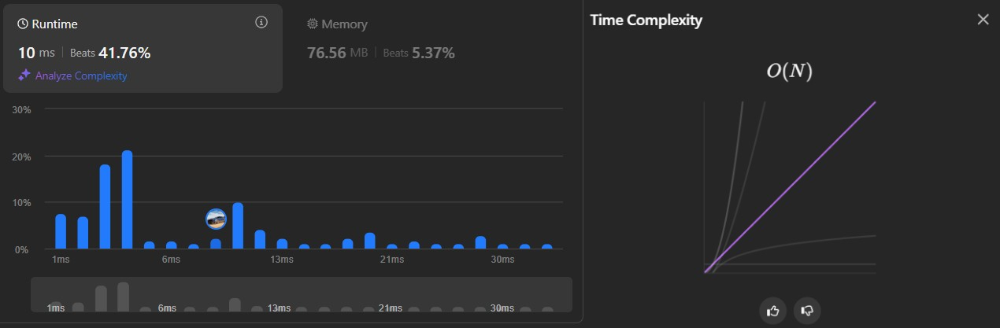

# Solution 2: Brute force (Hash Set)

See more: [Link](https://leetcode.com/problems/find-the-duplicate-number/submissions/1442368466/)


## Methodology

Still a **brute force** method similar to [Solution #1][1], but instead of using a list, this solution uses hash set, a unique collection only contains **one copy of the value**:

```cs
public class Solution 
{ 
	public int FindDuplicate(int[] nums) {
		HashSet<int> find_dup = new HashSet<int>(); 
		foreach(int num in nums) 
		{ 
			if (!find_dup.Add(num)) 
				return num; 
		} 
		return -1; 
	} 
}
```

As a *brute force* way, there is a `for` loop similar to [Solution #1][1], but the addition mechanism is changed since I used ***hash set***. When a duplication is about to be added in ***hash set***, it will be rejected from the set.

In C#, hash set's `Add(value)` returns a **boolean**. `Add(value)` returns **true** if the value is added and **false** if there is the same value in the set and not added (see [here][hash set Add()]). Therefore, if the `Add(value)` returns false, ***the duplicate is found***:

```cs
	if (!find_dup.Add(num)) 
		return num;
```

## Performance
### Time complexity



> Given `n` is the total number of elements in input `nums`.

**Total:** O(n).

**Explanation:**
- Running through the source array `nums`: ***O(n)***. `(1)`
- Adding into hash set `find_dup`: ***O(1)***. `(2)`

**Conclusion:** execute `(2)` inside loop `(1)` => `(1)` x `(2)` = ***O(n)***

### Space complexity


> Due to the internal structure in **Hash set**, the actual result is worse from using simple lists in [Solution #1][1]

> Given `n` is the total number of elements in input `nums`.

**Total:** O(n).

**Explanation:**
- Input array `nums`: ***O(1)*** (constant). `(1)`
- Tracing hash set `find_dup_`: *O(m)*.

==Worst case:== no element found => running through entire `find_dup`: **m = n** => ***O(m) = O(n)***. `(2)`

**Conclusion:** `(1)` + `(2)` = *O(1) + O(n)* = ***O(n)***

[1]: ../#1.%20Brute%20force%20(List)/
[hash set Add()]: https://learn.microsoft.com/en-us/dotnet/api/system.collections.generic.hashset-1.add?view=net-8.0 