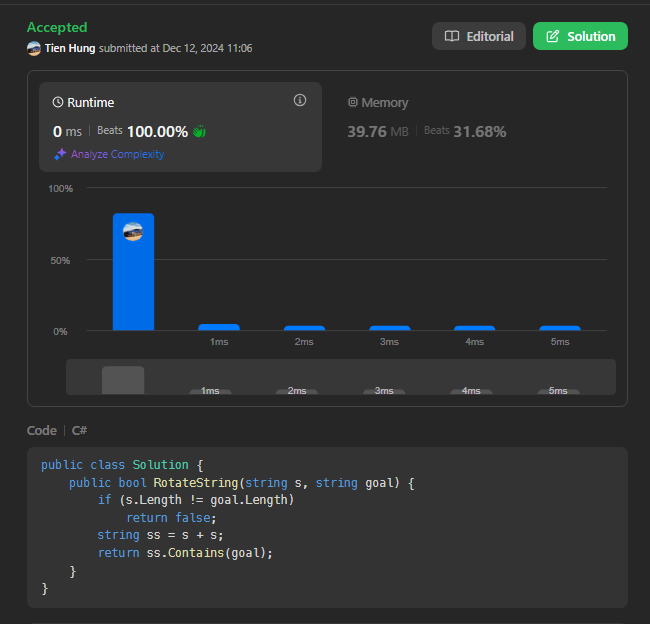
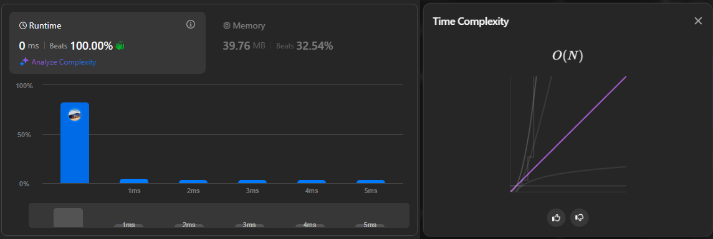
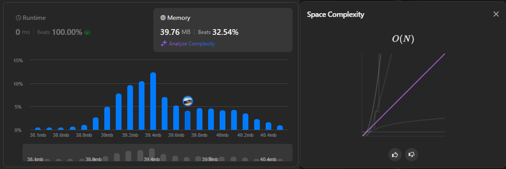

# Solution 1: String concanation

See more: [Link](https://leetcode.com/problems/rotate-string/submissions/1476651226/)



## Methodology

This solution involves *concanate* **two source inputs** and detect the string rotation by looking at the **concanated string**.

```cs
public class Solution {
    public bool RotateString(string s, string goal) {
        if (s.Length != goal.Length)
            return false;
        string ss = s + s;
        return ss.Contains(goal);
    }
}
```

First of all, we have input `s` which is rotated a few times to get output `goal`. Therefore, the obvious thing we can see is both strings' lengths **must be equal**. No addition or reduction, just think it as reorganizing the string.

> There were a few test cases that makes the output length *longer than* the input length, so I decided to place the code despite obvious redundancy.
```cs
	if (s.Length != goal.Length)
		return false;
```

Next, back to the main solution. As I said earlier, the input `s` is rotated, which also means the initial order of the characters (by viewing one character with their neighbors) is still the same. So by using the **concanated string**, you can see each characters and their relative neighbors, hence this is the explanation why the **concanated string** covers every string rotation.

> **For example:** We have input `s`: `abcde` and output `goal`: `cdeab`.
> We can see that `s` has been rotated *2 times*. And notice the letter `a` and its corresponding neighbors (with `b` on the right and `e` on the left despite being on the end of string).
> Now, we have the **concanated input**: `a`*b*cd*e*`a`*b*cd*e*.
> We can see both `a` have the same neighbor as I mentioned above. By applying this understanding, we can conclude that if the string is *rorated*, it will also be covered in **concanated string** as shown below:
> The string: ab`cdeab`cde.
>
> - Think of it as sliding the check on the **concanated string**.

```cs
	string ss = s + s;
    return ss.Contains(goal);
```

## Performance
### Time complexity



> Given `n` is the length of input `s` (and also that of output `goal`).

**Total:** O(n).

**Explanation:**
- Length conditional checking `if (s.Length != goal.Length)`: ***O(1)***. `(1)`
- String existence checking `string.Contains()`: ***O(n)***. `(2)`

**Conclusion:** `(1)` + `(2)` = *O(1) + O(n)* = ***O(n)***.

> **Note:** The fact that every other submissions is almost the same as mine is very `true`. The difference is whenever they like to place a variable or not.

### Space complexity



> Given `n` is the length of input `s` (and also that of output `goal`).

**Total:** O(n).

**Explanation:**
- Input striung `s`: ***O(n)***. `(1)`
- Concanate double input `s` into `ss`: 2 x `(1)` = 2 x ***O(n)*** = ***O(2n)***. `(2)` 

**Conclusion:** `(2)` = *O(2n)* ~ ***O(n)***. 

> **Note:** The only way to climb ranks in this problem is to reduce the number of code lines, even one liner beats the heck out of four-line solutions (in which I didn't do and **don't like** the idea => it kills the code explanation i tried to put).

## Acknowledgement
- **LeetCode's** [Problem Editorial (Approach 2)](https://leetcode.com/problems/rotate-string/editorial/)
